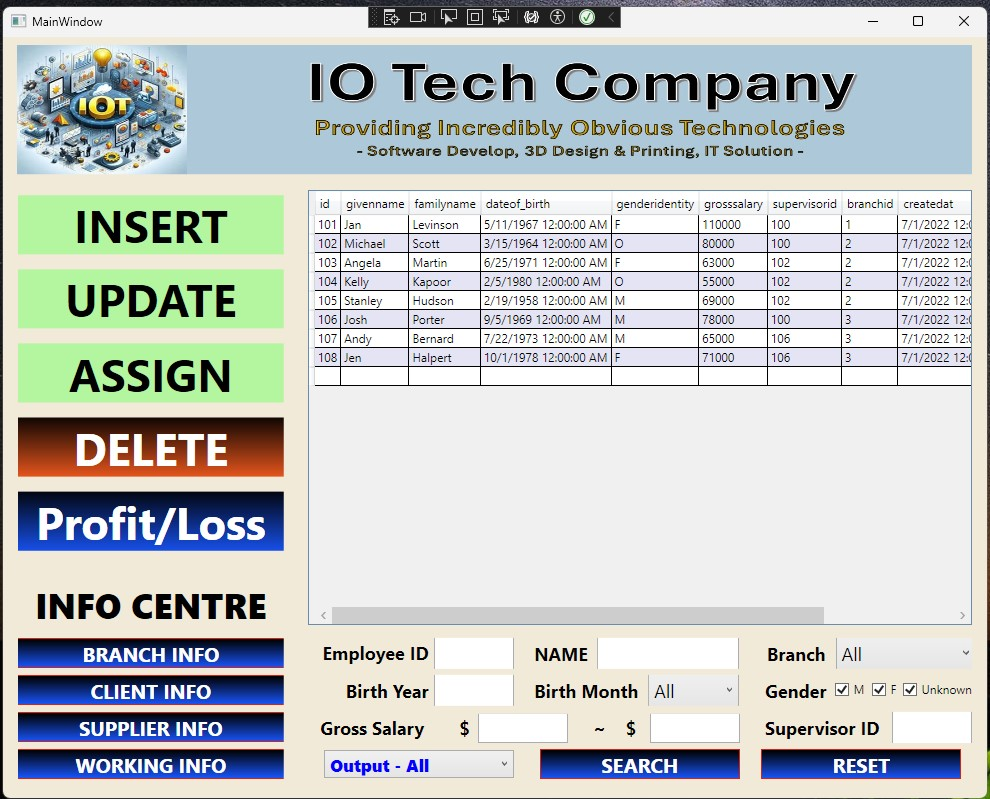
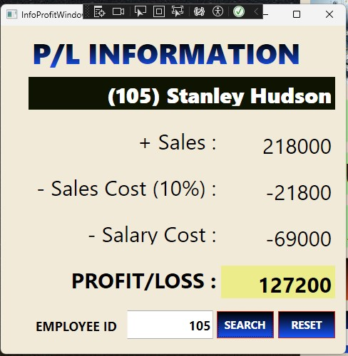
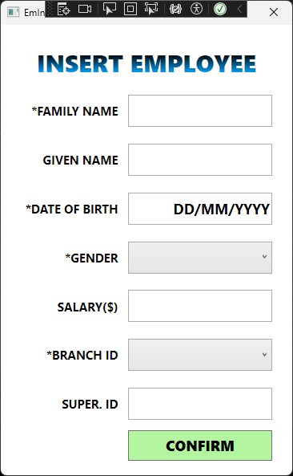
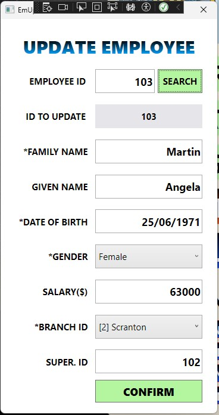

# HRSystemUsingDatabase
From Tafe s1 IT Certi 4 Assessment. HR Management Program using Database.

## Program Examples
### 1. Main Page

 

### 2. Profit $ Loss Page

 

### 3. Employee Insert

 

### 4. Employee Update

 
